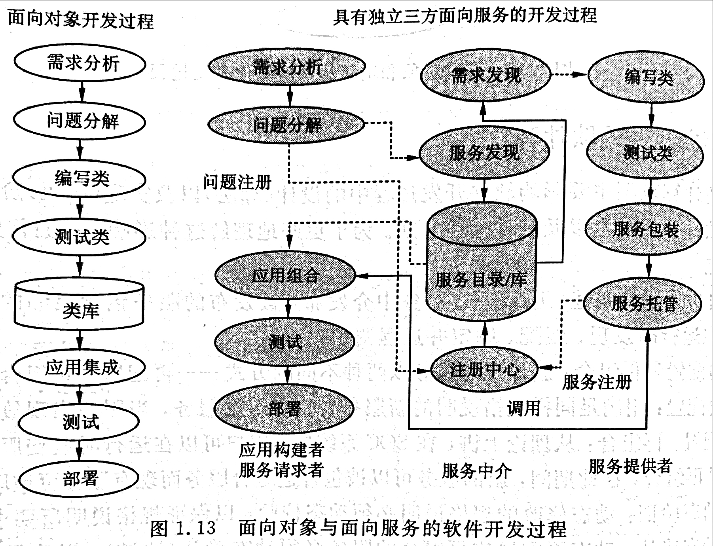

# 服务计算概论复习

## 第一章

### 1.什么是SOA,SOC,SOD,SOI,SOSE

* SOA:(面向服务体系结构)是一个分布式软件体系结构,它是通过松散耦合的服务构建的系统软件这些服务通过标准接口,例如WSDL(Web服务描述语言)接口,以及标准的消息交换协议,例如SOAP(简单对象访问协议)互相通信。这些服务是自治和独立于平台的。它们驻留在不同的计算机上并且为了实现期望的目标和最终结果使用彼此的服务
* SOC: (面向服务计算)是基于SOA模型的计算范型。它包括三个并发进程中表示的计算概念、原理以及方法。这三个并发进程是服务开发、服务发布以及使用发开出的服务进行应用组合。
* SOD:(面向服务开发)是基于SOA概念和SOC范型的整个软件开发周期,包括需求、问题定义、概念模型、规格说明、体系结构设计、组合、服务发现、服务实现、测试、评估、部署和维护,这些活动将实现可运行的软件。SOE:(面向服务企业)是一个通过SOA系统实现的一个并能外向展示业务过程的一系列技术。SOE为管理采用SOA技术的业务过程提供了一个框架。
* SOI:(面向服务的基础设施)①支持SOC的硬件和软件。②一个硬件系统可以像软件系统那样按面向服务的方式组织起来。
* SOSE:(面向服务的系统工程)是系统工程、软件工程和面向服务计算的一个组合,它建议在系统工程原则下开发面向服务的软件和硬件,这些原则包括需求、建模、规格说明、验证、设计、实现、确认、运行以及维护。

### 2.把服务提供者和应用构建者分开的主要优点是什么

SOC这种范型把开发者分成独立但相互协作的三方:应用构建者、服务中介、服务提供者。服务提供者的职责是开发具有标准接口的软件服务。服务中介发布或市场化可用服务。

应用构建者通过服务中介发现可用的服务并使用服务开发新的应用,通过发现和组合而不是传统的设计和编码来开发应用。换言之,应用开发是三方协作的结果。服务和平台无关并且松散耦合,因此在组合服务时,可以使用不同提供者开发的服务。

因此,把服务提供者和应用构建者分开的主要优点是:这种面向服务的体系机构给应用构建者最大的灵活性去选择最好的服务中介以及服务。

### 3.比较传统软件开发过程和面向服务软件开发过程。描述开发过程中的每一步的目的、职责和功能

* 在传统的软件开发过程中,整个过程往往由开发者所在组织管理。
* 面向服务软件的开发分为三个平行的过程:服务开发,服务发布到服务中介,应用构建(组合)。

①一个面向对象(OOC)应用由同一个团队使用相同的语言开发,而一个面向服务(SOC)应用是通过已开发好的服务创建,这些开发好的服务由独立的服务供应商开发。应用构建者通过服务目录和服务库, 查询所需服务。如果服务无法找到，应用者可以发 布需求或自己开发。服务提供者则根据自己的需求分析或查询目录中发布的需求来开发服务。

②(P20图1.13 )

### 4.什么是服务注册中心?什么是服务库?它们有什么区别

* 服务注册中心是服务发现的支持者。它包含一个可用服务的存储库,并允许感兴趣的服务使用者查找服务提供者接口。
* 服务数据库:包含系统中所有服务的信息和一个注册中心服务。
* 服务注册中心实现的基础是一个服务数据库,注册中心服务封装了这个数据库并提供了一套访问这些信息的“标准”APIs。

### 5.要开发电子旅行社。如果你分别是下面这些角色,你的职责是什么:(1)服务提供商?(2)服务中介?(3)应用构建者

* 服务提供者的职责是开发具有标准接口的电子旅行社相关软件服务。
* 服务中介发布或市场化可用服务。
* 应用构建者通过服务中介发现可用的电子旅行社相关服务并使用服务开发新的应用,通过发现和组合而不是传统的设计和编码来开发应用。

### 6.你计划开发一种在线游戏:(1)作为应用构建者你必须做什么?你希望服务提供者为你做什么?(2)描述你的想法,并列出作为应用建设者你该做的每一件事。(3)列出你可能通过服务中介找到的服务

1. 应用构建者通过服务中介发现可用的相关服务并使用服务开发新的应用,通过发现和组合。服务提供者开发具有标准接口的软件服务,他们需要使用编程语言如C++、C#和JAVA以及面向服务的软件开发环境开发软构建以提供不同的服务,这些软构建类似于OOC中的类和对象。
2. 应用构建者通过互联网查找中介服务注册中心,寻找需要的服务以及如何使用服务所需的说明。服务中介中的本体和分类法可以帮助在请求和注册的服务之间自动匹配。应用构建者使用可获得的服务进行组合以生成所需的应用。这是使用服务模块构建大型应用程序的更高层次的编程。
3. 游戏装备商场服务、网银服务、聊天室服务。

## 第二章

### 1.改进哲学家就餐问题使其不会产生死锁

每一次最多只能有4个哲学家(共有5个哲学家)申请就餐,这样其中的一个哲学家就能申请到两只筷子,就能够进餐,再将筷子释放给其他哲学家就餐,直到所有哲学家就餐完毕

### 2.异常处理与事件驱动编程的主要区别是什么

* 异常处理用于处理计算过程中发生的异常情况,是用来处理非正常情况的;
* 而基于事件驱动的编程时用于处理特殊的令人关注的事件,比如单击鼠标。

### 3.基于控制流的编程与事件编程的主要区别是什么

控制流驱动方法有唯一的程序入口,输入数据来自不同时间不同地点,只有当控制流返回这一地点时输入数据才被处理;在基于事件驱动的方法中,提供了事件板和报警板机制,事件板记录少量的紧迫请求,报警板负责更加迫切的请求。

### 4.代理与类有什么不同

代理是类型安全的,不执行隐式类型转换。

1. 代理允许方法名作为参数允许在不同的方法中执行同样的方法调用。
2. 通过把事件处理的名字传递给代理调用，代理可以用来定义回调函数。

### 5.代理与方法有什么不同？

答:代理声明定义了一个引用类型， 它可以封装一个带有特定签名的方法。代理类似于C++中的函数指针。

方法是一个可以被其它程序调用或者重用的代码块，方法通过名字、参数列表和返回类型来定义,编程时，方法作为程序的一个构件和控制流的一部分。

### 6. P110 24题

### 7. P110 25题

## 第三章

### 1.描述SOC软件开发中的SOAP的作用

SOAP（Simple Object Access Protocol ，简单对象访问协议）用于分布式环境中结构化信息的交换。在Web服务中，它主要用于通过网络和平台远程调用。SOAP是一个无状态的单向的信息交换协议。但是通过底层协议或/和特定应用信息提供的特征与单向交换组合，可以创建更复杂的交互模式和接口。

### 2.描述SOC软件开发中的WSDL的作用

WSDL(Web Service Description Language )是一种用通用的SML语法描述WEB服务的语言。WSDL描述了WEB 服务的四个关键方面:

1. 服务的功能
2. 参数值的数据类型以及函数(服务)调用的返回类型
3. 所使用的传输协议的绑定信息,一般都用SOAP 协议
4. 定位指定服务的地址信息

换句话说,WSDL表示了服务请求者和服务提供者之间的契约。这类似于面向对象语言中类中方法(成员函数)的接口,在面向对象语言中用户可以使用类中定义的函数的接口。关键的区别是,WSDL是平台和语言无关的,主要用于SOAP调用(虽然不是独有的)。
通过WSDL。客户可以找到web服务并调用其公开的任何功能,使用WSDL相关工具可以自动化这一过程,使新服务很容易集成到应用中,而很少或根本不用编码。因此,WSDL在web服务体系结构中很重要,因为它不但是用于描述服务的通用语言,而且是一个把服务自动集成到应用的平台。

潜在的,这一特征允许应用进行自动的重新配置和重新组合。重新配置就是用具有相同功能,但性能和可靠性更稳定的WEB服务替换应用中的服务。重新组合是指改变应用的结构和功能。

### 3.什么是服务端点?端点必须包括哪些信息

一个端点是一个暴露在外的服务接口(方法名和参数),因此客户可以访问服务中的操作(方法)。

一个端点包含地址(入口点)、操作名称、返回值类型和参数以及其类型等。

### 4.理想的服务中介应该提供哪些特征?目前的服务中介(UDDI、ebXML、临时登记表)提供了哪些功能

理想的服务中介应该具备的特征:服务注册、服务规范和需求、应用模板、GUI模板、数据库和本体论。

服务注册:这是服务中介的基本功能,它允许服务提供者注册他们服务的类型、描述、联系信息、访问点(如URL),并允许服务请求者基于它们拥有的部分信息发现他们想要的服务;

服务存储:托管服务的执行。为了支持大批量访问,托管服务器必须具有超级计算能力和高速的互联网连接;

服务规范和需求:如果某个服务请求者不能发现服务，可以发布规范或者需求，从而使服务提供者可以开发以满足规范或者需求的服务。服务需求使用自然语言书写,而服务规范用规格语言或者接口定义语言如WSDL编写;

应用模板:不仅是服务，由多个服务和图形用户界面( GUI )组成的应用也可以使用SOC规范。应用模板指定了应用的工作流、参与服务的描述、服务接受的标准以及应用集成标准。应用构建者采用应用模板开发应用;

GUI模板: GUI是一个软件产品成功的关键。GUI模板的发布可以帮助应用构建者通过使用现有的GUI设计创建用户友好的高效率的GUI;

合作协议和模板 :合作协议和模板定义了应该用什么语言定义合作以及服务之间如何通信。合作协议和模板的发布规范了服务提供者如何定义应用、GUI模板和服务接口。因为合作协议和模板提供了可重用的工作模式,这种模式可在应用和服务开发中采用,因而缩短了开发周期;

策略:基于策略的计算建议把数据和计算分离。用来反映策略变化的数据项存储在配置文件或者策略数据库中。策略的修改可以在运行时完成,无需中断程序的执行。为了重用，可以发布策略。另一方面，为了满足对服务中介的动态需求,服务中介应该用基于策略的计算实现;

数据库和本体论:服务中介是一个为它的客户提供各种不同服务的服务。为了存储和管理大量数据和服务， 数据库的支持是必不可少的。自动发现服务和应用模板是服务中介的需求。具有语义属性和推理能力的本体可以扩展传统数据库的能力,更好的支持自动化的服务发现;

集成测试和评估工具:测试和评估，包括测试用例生成、测试结果、验证、确认、可靠性评估和安全性评估, 都是软件开发中的关键而又苦难的步骤。服务中介可以提供工具,在绑定服务到应用之前,帮助应用构建者测试服务;

服务质量:服务中介可以跟踪并保存服务的性能和可信性数据是一项期望的功能。这些数据包括响应时间、吞吐量、可靠性、外部安全性以及成本效益。

UDDI 所提供的功能:

UDDI(统一描述,发现和集成协议),它的主要功能是服务注册,注册信息大致分为三部分:

1、白页包括服务提供者的姓名、身份和联系信息; 

2、黄页包括企业类型、产品和服务类型、地理位置;

3、绿页包括和服务相关的绑定信息、服务实现的技术参考模型、指向各种文件的指针以及基于URL的发现机制。程序可以搜索并解释这些信息。

ebXML 所提供的功能:

ebXML (用于电子商务的可扩展标记语言)是一种规格说明/标准的模块化组件, 这种规格说明/标准使任何地方任何规模的企业都可以通过互联网展开业务。ebXML除了提供服务注册之外,还提供了服务存储。ebXML的注册和存储中心提供了注册、定位以及访问分布式安全环境中的信息资源的服务,主要包括: 

1、注册联合支持; 

2、复制内容/元数据;

3、可扩展的服务接口和协议;

4、HTTP绑定到ebXML注册服务接口; 

5、内容管理(确认和目录管理); 

6、增强查询。

临时存放表所提供的功能:许多组织非正式地提供-个简单的服务列表或人工的服务注册中心，用户可以立即注册一个新的服务并通过浏览器列表人工搜索服务。有用的服务列表包括:

①远程方法;
②Web服务;
③Xmethods。

## 第五章

### 1.基于Web的计算模型有哪些，每种模型中计算通常在什么地方完成（客户端还是服务器端）

* 纯基于HTML的Web应用，在服务器端完成计算
* 客户端脚本 客户端完成
* 服务器端脚本 服务器端完成
* 服务器端后台代码 服务器端完成

### 2.现有状态管理机制有哪些，每种机制主要特点

| 状态管理 |特征|
| ------ | ------ |
|视图状态|在客户端浏览器的HTML页面的隐藏字段中保存一组字符串；同一页面可访问；当浏览器关闭，数据消失|
|会话状态|在服务器端保存一组对象；参与会话的所有页面可访问；当会话关闭时，数据消失|
|应用状态|在服务器端把一组对象存储为全局数据；应用中所有会话以及会话页面都可访问；当应用关闭时，数据消失|
|Cookies|在客户端机器的文件系统中存储字符串；客户可以停用cookies或清除cookies|
|缓存|保存最近使用的数据以供重用|
|服务文件系统|在服务器端的文件系统保存文本文件，二进制文件或XML文件|
|关系数据库|用表格保存数据；表格和XML之间需要转换；可以用XML或表格文件的方式访问数据库；使用关系数据库查询语言查询数据|
|XML数据库|把数据存为XML文件，使用XML查询语言查询数据|

## 第六章

### 1.系统的可靠性

是在一段时间内服务的可持续性。更精确地,系统的可靠性就是函数R(t),他是在时间段[0,t],系统成功运行的概率。

### 2.什么是质量?什么是软件质量的标准

概括地说,软件质量就是“软件与明确的和隐含的定义的需求相一致的程度”。具体地说,软件质量是软件符合明确叙述的功能和性能需求、文档中明确描述的开发标准、以及所有专业开发的软件都应具有的隐含特征的程度。影响软件质量的主要因素,这些因素是从管理角度对软件质量的度量。可划分为三组,分别反应用户在使用软件产品时的三种观点。正确性、健壮性、效率、完整性、可用性、风险(产品运行);可理解性、可维修性、灵活性、可测试性(产品修改);可移植性、可再用性、互运行性(产品转移)。
标准:

1. 软件需求是度量软件质量的基础,与需求不一致就是质量不高。
2. 指定的标准定义了一组指导软件开发的准则,如果没有遵守这些准则,几乎肯定会导致质量不高。
3. 通常,有一组没有显式描述的隐含需求(如期望软件是容易维护的)。如果软件满足明确描述的需求,但却不满足隐含的需求,那么软件的质量仍然是值得怀疑的。
